Programming Assignment 4
================
Monica Impaglia
2022-04-18

## My Hypothesis 1: I will finish this before midnight Monday

## I do not have a hypothesis as far as the relationship of the VOT, F1, F2. I am more focused on learning how to use R better

``` r
library("ggplot2")  
```

    ## Warning: package 'ggplot2' was built under R version 4.1.3

``` r
library("readr")  
```

    ## Warning: package 'readr' was built under R version 4.1.3

``` r
library("here")  
```

    ## Warning: package 'here' was built under R version 4.1.3

    ## here() starts at C:/Users/Home/OneDrive/Desktop/pa_4

``` r
library("tidyverse") 
```

    ## Warning: package 'tidyverse' was built under R version 4.1.3

    ## -- Attaching packages --------------------------------------- tidyverse 1.3.1 --

    ## v tibble  3.1.6     v dplyr   1.0.8
    ## v tidyr   1.2.0     v stringr 1.4.0
    ## v purrr   0.3.4     v forcats 0.5.1

    ## Warning: package 'dplyr' was built under R version 4.1.3

    ## Warning: package 'forcats' was built under R version 4.1.3

    ## -- Conflicts ------------------------------------------ tidyverse_conflicts() --
    ## x dplyr::filter() masks stats::filter()
    ## x dplyr::lag()    masks stats::lag()

``` r
library("dplyr")
library("purrr")  
```

``` r
args(read.csv)  
```

    ## function (file, header = TRUE, sep = ",", quote = "\"", dec = ".", 
    ##     fill = TRUE, comment.char = "", ...) 
    ## NULL

``` r
read.csv(file = "C:\\Users\\Home\\OneDrive\\Desktop\\pa_4\\data\\bi01.csv") 
```

    ##        fileID     f1      f2    vot notes
    ## 1   bi01_kaka 650.90 1637.02  24.81      
    ## 2  bi01_kaka1 714.32 1567.58  25.49      
    ## 3  bi01_kaka2 709.19 1560.03  28.29      
    ## 4   bi01_keke 495.24 2168.42  31.55      
    ## 5  bi01_keke1 893.01 2152.98  32.39      
    ## 6  bi01_keke2 579.31 2339.40  32.87      
    ## 7   bi01_kiki 823.90 2711.97  18.54      
    ## 8  bi01_kiki1 348.26 2632.05  52.80      
    ## 9  bi01_kiki2 493.55 2765.72  50.48      
    ## 10  bi01_koko 498.60 1049.62  30.88      
    ## 11 bi01_koko1 513.35 1012.33  23.98      
    ## 12 bi01_koko2 599.63 1095.21  26.13      
    ## 13  bi01_kuku 520.29 1085.70  31.55      
    ## 14 bi01_kuku1 457.27 1085.94  29.56      
    ## 15 bi01_kuku2 231.68 1523.96 167.71 error
    ## 16  bi01_paka 636.92 1798.53  10.82      
    ## 17 bi01_paka1 478.08 1203.61  26.06      
    ## 18 bi01_paka2 723.91 1591.12  18.49      
    ## 19  bi01_peke 480.94 2388.24  16.16      
    ## 20 bi01_peke1 538.02 2385.35  16.12      
    ## 21 bi01_peke2 586.71 2189.72  13.36      
    ## 22  bi01_piki 394.24 2572.92  23.80      
    ## 23 bi01_piki1 300.41 2576.74  27.74      
    ## 24 bi01_piki2 412.77 2696.80  14.36      
    ## 25  bi01_poko 574.84 1182.03  20.75      
    ## 26 bi01_poko1 456.21 1060.58  17.19      
    ## 27 bi01_poko2 350.93 1039.92  18.90      
    ## 28  bi01_puku 436.90  936.48  18.83      
    ## 29 bi01_puku1 438.71  919.01  46.71      
    ## 30 bi01_puku2 425.06  979.09  23.93      
    ## 31  bi01_taka 662.33 1678.52  10.16      
    ## 32 bi01_taka1 697.26 1675.21  16.65      
    ## 33 bi01_taka2 300.67 1410.20  17.95      
    ## 34  bi01_teke 518.24 2340.06  15.48      
    ## 35 bi01_teke1 669.55 2311.48  14.44      
    ## 36 bi01_teke2 514.68 2361.35  17.17      
    ## 37  bi01_tiki 298.87 2629.78  16.16      
    ## 38 bi01_tiki1 461.89 2637.19  18.80      
    ## 39 bi01_tiki2 448.42 2666.14  27.66      
    ## 40  bi01_toko 598.46 1154.98  16.57      
    ## 41 bi01_toko1 526.94 1062.50  16.22      
    ## 42 bi01_toko2 510.96 1073.20  19.27      
    ## 43  bi01_tuku 529.54  831.24  14.10      
    ## 44 bi01_tuku1 477.36 1022.60  22.78      
    ## 45 bi01_tuku2 432.98  963.16  15.22

``` r
bi01 <- read.csv("C:\\Users\\Home\\OneDrive\\Desktop\\pa_4\\data\\bi01.csv")  
read.csv(file = "C:\\Users\\Home\\OneDrive\\Desktop\\pa_4\\data\\bi02.csv") 
```

    ##        fileID     f1      f2   vot notes
    ## 1   bi02_kaka 783.18 1573.67 22.16    NA
    ## 2  bi02_kaka1 751.01 1506.98 33.50    NA
    ## 3  bi02_kaka2 517.16 1483.86 26.15    NA
    ## 4   bi02_keke 472.54 2191.83 22.46    NA
    ## 5  bi02_keke1 468.29 2329.28 24.03    NA
    ## 6  bi02_keke2 516.70 2236.64 19.40    NA
    ## 7   bi02_kiki 334.92 2633.94 24.55    NA
    ## 8  bi02_kiki1 348.52 2670.39 22.11    NA
    ## 9  bi02_kiki2 338.73 2640.17 15.90    NA
    ## 10  bi02_koko 617.86 1002.35 32.24    NA
    ## 11 bi02_koko1 594.89  965.36 32.32    NA
    ## 12 bi02_koko2 469.55  890.58 25.10    NA
    ## 13  bi02_kuku 471.80  911.34 18.91    NA
    ## 14 bi02_kuku1 467.64  917.97 25.70    NA
    ## 15 bi02_kuku2 294.34  765.39 22.11    NA
    ## 16  bi02_paka 805.76 1633.69  3.54    NA
    ## 17 bi02_paka1 732.12 1473.71 11.82    NA
    ## 18 bi02_paka2 679.30 1622.45  6.83    NA
    ## 19  bi02_peke 500.73 2264.74 18.12    NA
    ## 20 bi02_peke1 461.51 2349.75 22.18    NA
    ## 21 bi02_peke2 487.41 2338.48 12.14    NA
    ## 22  bi02_piki 358.38 1647.36 17.03    NA
    ## 23 bi02_piki1 288.19 2476.28 13.26    NA
    ## 24 bi02_piki2 575.24 2682.57 14.42    NA
    ## 25  bi02_poko 581.06  919.14 15.58    NA
    ## 26 bi02_poko1 580.26  948.78 12.49    NA
    ## 27 bi02_poko2 567.13 1058.16 14.52    NA
    ## 28  bi02_puku 506.83  898.78 24.38    NA
    ## 29 bi02_puku1 461.25  866.07  4.25    NA
    ## 30 bi02_puku2 448.60  802.34 18.59    NA
    ## 31  bi02_taka 814.28 1551.35  4.31    NA
    ## 32 bi02_taka1 744.68 1527.25 10.82    NA
    ## 33 bi02_taka2 531.90 1451.78 16.13    NA
    ## 34  bi02_teke 529.28 2217.34 12.49    NA
    ## 35 bi02_teke1 464.94 2336.30 12.76    NA
    ## 36 bi02_teke2 390.46 1712.11 11.84    NA
    ## 37  bi02_tiki 647.64 2404.66 10.79    NA
    ## 38 bi02_tiki1 346.00 2751.28 12.21    NA
    ## 39 bi02_tiki2 511.54 1763.09 24.75    NA
    ## 40  bi02_toko 495.31  885.93  2.32    NA
    ## 41 bi02_toko1 540.73  965.41 11.52    NA
    ## 42 bi02_toko2 604.69 1000.63 12.65    NA
    ## 43  bi02_tuku 472.58  961.42 12.49    NA
    ## 44 bi02_tuku1 466.53  931.76 10.27    NA
    ## 45 bi02_tuku2 519.02  835.25 12.38    NA

``` r
bi02 <- read.csv("C:\\Users\\Home\\OneDrive\\Desktop\\pa_4\\data\\bi02.csv")
read.csv(file = "C:\\Users\\Home\\OneDrive\\Desktop\\pa_4\\data\\bi03.csv") 
```

    ##        fileID      f1      f2    vot notes
    ## 1   bi03_kaka 1176.70 1890.14  17.72    NA
    ## 2  bi03_kaka1  826.99 1498.01  29.94    NA
    ## 3  bi03_kaka2  844.62 1646.63  20.76    NA
    ## 4   bi03_keke  688.18 2369.00  17.71    NA
    ## 5  bi03_keke1  526.44 2277.97  18.09    NA
    ## 6  bi03_keke2  460.16 2524.86  14.32    NA
    ## 7   bi03_kiki  399.17 2665.41  10.64    NA
    ## 8  bi03_kiki1  351.70 2701.52  32.67    NA
    ## 9  bi03_kiki2  345.05 2679.93  23.98    NA
    ## 10  bi03_koko  468.09  858.49  27.66    NA
    ## 11 bi03_koko1  559.88  898.05  30.39    NA
    ## 12 bi03_koko2  784.77 1141.21  29.82    NA
    ## 13  bi03_kuku  397.99  757.12  21.40    NA
    ## 14 bi03_kuku1  255.40 1684.66  24.46    NA
    ## 15 bi03_kuku2  410.16  828.57  27.66    NA
    ## 16  bi03_paka 1130.65 1700.77  11.50    NA
    ## 17 bi03_paka1  753.43 1621.72   6.87    NA
    ## 18 bi03_paka2  636.52 1781.05  13.52    NA
    ## 19  bi03_peke  450.30 1816.62   7.96    NA
    ## 20 bi03_peke1  554.05 2330.84  11.21    NA
    ## 21 bi03_peke2  950.14 2443.70  11.93    NA
    ## 22  bi03_piki  366.73 2693.89  16.45    NA
    ## 23 bi03_piki1  322.30 2788.73 351.75    NA
    ## 24 bi03_piki2 1502.14 2723.49  14.10    NA
    ## 25  bi03_poko  533.66  886.33  26.58    NA
    ## 26 bi03_poko1  621.90 1847.78  15.33    NA
    ## 27 bi03_poko2  514.48  865.45  16.11    NA
    ## 28  bi03_puku  528.24  709.65  19.10    NA
    ## 29 bi03_puku1  673.58 1661.57  26.73    NA
    ## 30 bi03_puku2  421.46  815.00  11.08    NA
    ## 31  bi03_taka  757.65 1639.12  11.21    NA
    ## 32 bi03_taka1  830.61 1644.62  21.99    NA
    ## 33 bi03_taka2  860.67 1540.07  11.76    NA
    ## 34  bi03_teke  463.69 2348.80  24.74    NA
    ## 35 bi03_teke1  454.41 2399.64  14.72    NA
    ## 36 bi03_teke2  432.69 2440.64   9.53    NA
    ## 37  bi03_tiki  356.56 2505.36  14.67    NA
    ## 38 bi03_tiki1  882.27 2252.59   9.76    NA
    ## 39 bi03_tiki2  420.40 1898.42  13.88    NA
    ## 40  bi03_toko  794.81  977.79  14.10    NA
    ## 41 bi03_toko1  756.44 1115.56  15.37    NA
    ## 42 bi03_toko2  773.51 1066.25  10.99    NA
    ## 43  bi03_tuku  655.25  790.44  13.67    NA
    ## 44 bi03_tuku1  399.78  736.93  11.00    NA
    ## 45 bi03_tuku2  400.55  746.75   9.57    NA

``` r
bi03 <- read.csv("C:\\Users\\Home\\OneDrive\\Desktop\\pa_4\\data\\bi03.csv")
read.csv(file = "C:\\Users\\Home\\OneDrive\\Desktop\\pa_4\\data\\ne01.csv") 
```

    ##        fileID      f1      f2    vot notes
    ## 1   ne01_kaka  871.22 1653.65  20.76    NA
    ## 2  ne01_kaka1  948.22 1775.21  30.78    NA
    ## 3  ne01_kaka2 1078.14 1776.63   9.95    NA
    ## 4   ne01_keke  478.92 2558.50   4.07    NA
    ## 5  ne01_keke1  599.95 2409.78   8.90    NA
    ## 6  ne01_keke2  487.90 2662.94   4.34    NA
    ## 7   ne01_kiki  316.23 2838.87   6.51    NA
    ## 8  ne01_kiki1  983.77 2299.48  14.93    NA
    ## 9  ne01_kiki2  438.63 2779.69   6.84    NA
    ## 10  ne01_koko  653.70 1126.70  11.68    NA
    ## 11 ne01_koko1  569.17 1061.06   5.06    NA
    ## 12 ne01_koko2  653.42 1103.28  31.11    NA
    ## 13  ne01_kuku  487.32 1099.85   3.37    NA
    ## 14 ne01_kuku1  443.94 1011.56   8.25    NA
    ## 15 ne01_kuku2  968.16 1828.76   6.97    NA
    ## 16  ne01_paka  769.80 1494.49   6.95    NA
    ## 17 ne01_paka1  800.61 1542.03  27.49    NA
    ## 18 ne01_paka2  838.54 1635.85  30.59    NA
    ## 19  ne01_peke  385.16 2661.29  24.09    NA
    ## 20 ne01_peke1  368.66 2654.04 105.86    NA
    ## 21 ne01_peke2  546.72 2518.53  33.43    NA
    ## 22  ne01_piki  399.59 2859.50  13.67    NA
    ## 23 ne01_piki1  419.41 2879.66  16.31    NA
    ## 24 ne01_piki2  372.19 2936.60  92.56    NA
    ## 25  ne01_poko  514.93 1083.13  18.29    NA
    ## 26 ne01_poko1  577.05 1155.81  22.13    NA
    ## 27 ne01_poko2  505.11 1052.33  16.32    NA
    ## 28  ne01_puku  419.64 1062.46  19.56    NA
    ## 29 ne01_puku1  449.91 1061.50  41.78    NA
    ## 30 ne01_puku2  436.50 1014.13  46.34    NA
    ## 31  ne01_taka  881.10 1706.42  11.12    NA
    ## 32 ne01_taka1 1199.75 1765.73  21.29    NA
    ## 33 ne01_taka2  924.84 1739.52  11.94    NA
    ## 34  ne01_teke  513.66 2481.46  13.32    NA
    ## 35 ne01_teke1  551.71 2477.58   8.16    NA
    ## 36 ne01_teke2  727.91 2500.63  41.40    NA
    ## 37  ne01_tiki  371.06 2907.47   7.94    NA
    ## 38 ne01_tiki1  378.24 2830.15   8.23    NA
    ## 39 ne01_tiki2  364.09 3002.01  40.71    NA
    ## 40  ne01_toko  569.86  965.08  34.19    NA
    ## 41 ne01_toko1  433.31 1097.56  17.97    NA
    ## 42 ne01_toko2  570.62 1065.35   8.50    NA
    ## 43  ne01_tuku  419.66 1071.61   8.46    NA
    ## 44 ne01_tuku1  414.20 1071.88   4.07    NA
    ## 45 ne01_tuku2 1050.65 1647.46  38.83    NA

``` r
ne01 <- read.csv("C:\\Users\\Home\\OneDrive\\Desktop\\pa_4\\data\\ne01.csv")
read.csv(file = "C:\\Users\\Home\\OneDrive\\Desktop\\pa_4\\data\\ne02.csv") 
```

    ##        fileID      f1      f2   vot notes
    ## 1   ne02_kaka  637.74 1459.14 42.52    NA
    ## 2  ne02_kaka1  937.59 2237.85 55.64    NA
    ## 3  ne02_kaka2   63.32 1504.01 66.00    NA
    ## 4   ne02_keke  465.33 2408.59 15.63    NA
    ## 5  ne02_keke1  443.12 2513.76 11.87    NA
    ## 6  ne02_keke2  499.21 2241.81 71.22    NA
    ## 7   ne02_kiki  355.94 2685.76 23.55    NA
    ## 8  ne02_kiki1  356.91 2757.82 25.39    NA
    ## 9  ne02_kiki2  320.10 2784.88 25.83    NA
    ## 10  ne02_koko  556.13 1042.12 48.47    NA
    ## 11 ne02_koko1  423.92 1023.12 37.82    NA
    ## 12 ne02_koko2  531.49 1077.13 49.87    NA
    ## 13  ne02_kuku  914.82 1163.34 64.86    NA
    ## 14 ne02_kuku1  404.03 1103.48 12.74    NA
    ## 15 ne02_kuku2  404.03 1103.48 12.74    NA
    ## 16  ne02_paka  761.37 1680.15 32.91    NA
    ## 17 ne02_paka1  865.33 1520.16 18.31    NA
    ## 18 ne02_paka2 1056.65 1785.13  7.81    NA
    ## 19  ne02_peke  542.71 2398.48 10.35    NA
    ## 20 ne02_peke1  526.74 2453.99 40.28    NA
    ## 21 ne02_peke2  528.25 2472.28 10.45    NA
    ## 22  ne02_piki  346.56 2628.01 37.45    NA
    ## 23 ne02_piki1  380.60 2718.67 18.47    NA
    ## 24 ne02_piki2  446.15 2643.37 10.82    NA
    ## 25  ne02_poko  570.19 1011.58  8.36    NA
    ## 26 ne02_poko1 1013.07 2155.93  9.15    NA
    ## 27 ne02_poko2  464.12 1222.14 15.31    NA
    ## 28  ne02_puku  436.29 1052.62 21.28    NA
    ## 29 ne02_puku1  494.90 1207.08  7.60    NA
    ## 30 ne02_puku2  449.81 1262.06 13.52    NA
    ## 31  ne02_taka  844.07 1766.15  9.41    NA
    ## 32 ne02_taka1  828.00 1586.42 34.19    NA
    ## 33 ne02_taka2  813.39 1651.79 39.07    NA
    ## 34  ne02_teke  518.57 2405.18 23.88    NA
    ## 35 ne02_teke1  482.79 2441.53 31.83    NA
    ## 36 ne02_teke2  681.69 1836.04 39.11    NA
    ## 37  ne02_tiki  312.84 2835.78 38.26    NA
    ## 38 ne02_tiki1  319.13 2737.40 35.46    NA
    ## 39 ne02_tiki2  310.15 2739.45 36.03    NA
    ## 40  ne02_toko  479.06  999.50 34.23    NA
    ## 41 ne02_toko1  596.46 1157.19 35.46    NA
    ## 42 ne02_toko2  534.84 1020.29 32.46    NA
    ## 43  ne02_tuku  470.32 1304.92 31.42    NA
    ## 44 ne02_tuku1  446.60 1125.78 44.57    NA
    ## 45 ne02_tuku2  793.10 1254.11 48.86    NA

``` r
ne02 <- read.csv("C:\\Users\\Home\\OneDrive\\Desktop\\pa_4\\data\\ne02.csv")
read.csv(file = "C:\\Users\\Home\\OneDrive\\Desktop\\pa_4\\data\\ne03.csv") 
```

    ##        fileID     f1      f2   vot notes
    ## 1   ne03_kaka 787.23 1793.60 28.10    NA
    ## 2  ne03_kaka1 819.31 1723.30 31.75    NA
    ## 3  ne03_kaka2 875.10 1311.05 41.53    NA
    ## 4   ne03_keke 613.08 2639.93 34.00    NA
    ## 5  ne03_keke1 575.35 1856.31 31.89    NA
    ## 6  ne03_keke2 563.89 2513.54 42.10    NA
    ## 7   ne03_kiki 524.21 2724.14 37.45    NA
    ## 8  ne03_kiki1 396.31 2223.50 16.71    NA
    ## 9  ne03_kiki2 377.94 2795.15  7.38    NA
    ## 10  ne03_koko 505.66 1071.41 15.19    NA
    ## 11 ne03_koko1 539.02 1202.59 32.79    NA
    ## 12 ne03_koko2 579.16 1092.66 39.80    NA
    ## 13  ne03_kuku 521.80 1002.63 50.43    NA
    ## 14 ne03_kuku1 467.85 1072.56 61.23    NA
    ## 15 ne03_kuku2 414.37 1056.61 48.09    NA
    ## 16  ne03_paka 856.88 1763.18 12.70    NA
    ## 17 ne03_paka1 743.37 1813.40 30.78    NA
    ## 18 ne03_paka2 762.05 1890.45  7.99    NA
    ## 19  ne03_peke 549.51 1714.59  9.83    NA
    ## 20 ne03_peke1 752.75 2472.28 34.01    NA
    ## 21 ne03_peke2 595.15 2221.66 20.02    NA
    ## 22  ne03_piki 365.08 2779.55 10.04    NA
    ## 23 ne03_piki1 378.88 2029.75 35.15    NA
    ## 24 ne03_piki2 390.53 2158.38 15.19    NA
    ## 25  ne03_poko 638.96 1120.04 11.58    NA
    ## 26 ne03_poko1 590.00 1178.63 34.56    NA
    ## 27 ne03_poko2 594.94 1100.12 37.23    NA
    ## 28  ne03_puku 460.02 1072.87 31.84    NA
    ## 29 ne03_puku1 424.32  962.90 47.60    NA
    ## 30 ne03_puku2 482.69  984.26  7.38    NA
    ## 31  ne03_taka 640.45 1240.91 25.96    NA
    ## 32 ne03_taka1 861.93 1734.87 21.52    NA
    ## 33 ne03_taka2 527.75  957.23 22.80    NA
    ## 34  ne03_teke 577.00 1518.99 35.60    NA
    ## 35 ne03_teke1 572.57 1858.34 31.11    NA
    ## 36 ne03_teke2 564.18 1688.81 27.35    NA
    ## 37  ne03_tiki 381.70 2787.96 44.92    NA
    ## 38 ne03_tiki1 378.38 1507.38 76.97    NA
    ## 39 ne03_tiki2 416.35 1673.19 31.76    NA
    ## 40  ne03_toko 617.97 1098.87 33.38    NA
    ## 41 ne03_toko1 635.59 1204.97 39.11    NA
    ## 42 ne03_toko2 543.16 1085.72 36.61    NA
    ## 43  ne03_tuku 445.69 1094.78 45.98    NA
    ## 44 ne03_tuku1 429.00 1050.45 56.74    NA
    ## 45 ne03_tuku2 479.00 1120.22 43.44    NA

``` r
ne03 <- read.csv("C:\\Users\\Home\\OneDrive\\Desktop\\pa_4\\data\\ne03.csv")
```

``` r
mean(bi01[1:3, "f1"])
```

    ## [1] 691.47

``` r
mean(bi01[16:18, "f1"])
```

    ## [1] 612.97

``` r
mean(bi01[31:33, "f1"])
```

    ## [1] 553.42

``` r
bi01af1 <- c(691.47, 612.97, 553.42)  
mean(bi01af1)  
```

    ## [1] 619.2867

``` r
bi01_af1mean <- 619.2867
```

``` r
mean(bi01[4:6, "f1"])
```

    ## [1] 655.8533

``` r
mean(bi01[19:21, "f1"])
```

    ## [1] 535.2233

``` r
mean(bi01[34:36, "f1"])
```

    ## [1] 567.49

``` r
bi01ef1 <- c(655.8533, 535.2233, 567.49)
mean(bi01ef1)
```

    ## [1] 586.1889

``` r
bi01_ef1mean <- 586.1889
```

``` r
mean(bi01[7:9, "f1"])
```

    ## [1] 555.2367

``` r
mean(bi01[22:24, "f1"])
```

    ## [1] 369.14

``` r
mean(bi01[37:39, "f1"])
```

    ## [1] 403.06

``` r
bi01if1 <- c(555.2367, 369.14, 406.06) 
mean(bi01if1)  
```

    ## [1] 443.4789

``` r
bi01_if1mean <- 443.4789
```

``` r
mean(bi01[10:12, "f1"])
```

    ## [1] 537.1933

``` r
mean(bi01[25:27, "f1"])
```

    ## [1] 460.66

``` r
mean(bi01[40:42, "f1"])
```

    ## [1] 545.4533

``` r
bi01of1 <- c(537.1933, 460.66, 545.4533)  
mean(bi01of1)
```

    ## [1] 514.4355

``` r
bi01_of1mean <- 514.4355  
```

``` r
mean(bi01[13:15, "f1"])
```

    ## [1] 403.08

``` r
mean(bi01[28:30, "f1"])
```

    ## [1] 433.5567

``` r
mean(bi01[43:45, "f1"])
```

    ## [1] 479.96

``` r
bi01uf1 <- c(403.08, 433.5567, 479.96)
mean(bi01uf1)
```

    ## [1] 438.8656

``` r
bi01_uf1mean <- mean(bi01uf1)
```

``` r
mean(bi02[1:3, "f1"])
```

    ## [1] 683.7833

``` r
mean(bi02[16:18, "f1"])
```

    ## [1] 739.06

``` r
mean(bi02[31:33, "f1"])
```

    ## [1] 696.9533

``` r
bi02af1 <- c(683.7833, 739.06,  696.9533)  
mean(bi02af1)  
```

    ## [1] 706.5989

``` r
bi02_af1mean <- 706.5989
```

``` r
mean(bi02[4:6, "f1"])
```

    ## [1] 485.8433

``` r
mean(bi02[19:21, "f1"])
```

    ## [1] 483.2167

``` r
mean(bi02[34:36, "f1"])
```

    ## [1] 461.56

``` r
bi02ef1 <- c(485.8433, 483.2167, 461.56)
mean(bi01ef1)
```

    ## [1] 586.1889

``` r
bi02_ef1mean <- 476.8733
```

``` r
mean(bi02[7:9, "f1"])
```

    ## [1] 340.7233

``` r
mean(bi02[22:24, "f1"])
```

    ## [1] 407.27

``` r
mean(bi02[37:39, "f1"])
```

    ## [1] 501.7267

``` r
bi02if1 <- c(340.7233, 407.27, 501.7267) 
mean(bi02if1)  
```

    ## [1] 416.5733

``` r
bi02_if1mean <- 416.5733
```

``` r
mean(bi02[10:12, "f1"])
```

    ## [1] 560.7667

``` r
mean(bi02[25:27, "f1"])
```

    ## [1] 576.15

``` r
mean(bi02[40:42, "f1"])
```

    ## [1] 546.91

``` r
bi02of1 <- c(560.7667, 576.15, 546.91)  
mean(bi02of1)
```

    ## [1] 561.2756

``` r
bi02_of1mean <- 561.2756  
```

``` r
mean(bi02[13:15, "f1"])
```

    ## [1] 411.26

``` r
mean(bi02[28:30, "f1"])
```

    ## [1] 472.2267

``` r
mean(bi02[43:45, "f1"])
```

    ## [1] 486.0433

``` r
bi02uf1 <- c(411.26, 472.2267, 486.0433)
mean(bi02uf1)
```

    ## [1] 456.51

``` r
bi02_uf1mean <- mean(bi01uf1)
```

``` r
mean(bi03[1:3, "f1"])
```

    ## [1] 949.4367

``` r
mean(bi03[16:18, "f1"])
```

    ## [1] 840.2

``` r
mean(bi03[31:33, "f1"])
```

    ## [1] 816.31

``` r
bi03af1 <- c(mean(bi03[1:3, "f1"]), mean(bi03[16:18, "f1"]), mean(bi03[31:33, "f1"]))
bi03_af1mean <- mean(bi03af1)
```

``` r
mean(bi03[4:6, "f1"])
```

    ## [1] 558.26

``` r
mean(bi03[19:21, "f1"])
```

    ## [1] 651.4967

``` r
mean(bi03[34-36, "f1"])
```

    ## [1] 610.6177

``` r
bi03ef1 <- c(mean(bi03[4:6, "f1"]), mean(bi03[19:21, "f1"]), mean(bi03[34:36, "f1"]))
bi03_ef1mean <- mean(bi03ef1)
```

``` r
mean(bi03[7:9, "f1"])
```

    ## [1] 365.3067

``` r
mean(bi03[22:24, "f1"])
```

    ## [1] 730.39

``` r
mean(bi03[37:39, "f1"])
```

    ## [1] 553.0767

``` r
bi03if1 <- c(mean(bi03[7:9, "f1"]), mean(bi03[22:24, "f1"]), mean(bi03[37:39, "f1"]))
bi03_if1mean <- mean(bi03if1)
```

``` r
mean(bi03[10:12, "f1"])
```

    ## [1] 604.2467

``` r
mean(bi03[25:27, "f1"])
```

    ## [1] 556.68

``` r
mean(bi03[40:42, "f1"])
```

    ## [1] 774.92

``` r
bi03of1 <- c(mean(bi03[10:12, "f1"]), mean(bi03[25:27, "f1"]), mean(bi03[40:42, "f1"]))
bi03_of1mean <- mean(bi03of1)
```

``` r
mean(bi03[13:15, "f1"])
```

    ## [1] 354.5167

``` r
mean(bi03[28:30, "f1"])
```

    ## [1] 541.0933

``` r
mean(bi03[43:45, "f1"])
```

    ## [1] 485.1933

``` r
bi03uf1 <- c(mean(bi03[13:15, "f1"]), mean(bi03[28:30, "f1"]), mean(bi03[43:45, "f1"]))
bi03_uf1mean <- mean(bi03uf1)
```

``` r
mean(ne01[1:3, "f1"])
```

    ## [1] 965.86

``` r
mean(ne01[16:18, "f1"])
```

    ## [1] 802.9833

``` r
mean(ne01[31:33, "f1"])
```

    ## [1] 1001.897

``` r
ne01af1 <- c(mean(ne01[1:3, "f1"]), mean(ne01[16:18, "f1"]), mean(ne01[31:33, "f1"]))
ne01_af1mean <- mean(ne01af1)
```

``` r
mean(ne01[4:6, "f1"])
```

    ## [1] 522.2567

``` r
mean(ne01[19:21, "f1"])
```

    ## [1] 433.5133

``` r
mean(ne01[34:36, "f1"])
```

    ## [1] 597.76

``` r
ne01ef1 <- c(mean(ne01[4:6, "f1"]), mean(ne01[19:21, "f1"]), mean(ne01[34:36, "f1"]))
ne01_ef1mean <- mean(ne01ef1)
```

``` r
mean(ne01[7:9, "f1"])
```

    ## [1] 579.5433

``` r
mean(ne01[22:24, "f1"])
```

    ## [1] 397.0633

``` r
mean(ne01[37:39, "f1"])
```

    ## [1] 371.13

``` r
ne01if1 <- c(mean(ne01[7:9, "f1"]), mean(ne01[22:24, "f1"]), mean(ne01[37:39, "f1"]))
ne01_if1mean <- mean(ne01if1)
```

``` r
mean(ne01[10:12, "f1"])
```

    ## [1] 625.43

``` r
mean(ne01[25:27, "f1"])
```

    ## [1] 532.3633

``` r
mean(ne01[40:42, "f1"])
```

    ## [1] 524.5967

``` r
ne01of1 <- c(mean(ne01[10:12, "f1"]), mean(ne01[25:27, "f1"]), mean(ne01[40:42, "f1"]))
ne01_of1mean <- mean(ne01of1)
```

``` r
mean(ne01[13:15, "f1"])
```

    ## [1] 633.14

``` r
mean(ne01[28:30, "f1"])
```

    ## [1] 435.35

``` r
mean(ne01[43:45, "f1"])
```

    ## [1] 628.17

``` r
ne01uf1 <- c(mean(ne01[13:15, "f1"]), mean(ne01[28:30, "f1"]), mean(ne01[43:45, "f1"]))
ne01_uf1mean <- mean(ne01uf1)
```

``` r
mean(ne02[1:3, "f1"])
```

    ## [1] 546.2167

``` r
mean(ne02[16:18, "f1"])
```

    ## [1] 894.45

``` r
mean(ne02[31:33, "f1"])
```

    ## [1] 828.4867

``` r
ne02af1 <- c(mean(ne02[1:3, "f1"]), mean(ne02[16:18, "f1"]), mean(ne02[31:33, "f1"]))
ne02_af1mean <- mean(ne02af1)
```

``` r
mean(ne02[4:6, "f1"])
```

    ## [1] 469.22

``` r
mean(ne02[19:21, "f1"])
```

    ## [1] 532.5667

``` r
mean(ne02[34:36, "f1"])
```

    ## [1] 561.0167

``` r
ne02ef1 <- c(mean(ne02[4:6, "f1"]), mean(ne02[19:21, "f1"]), mean(ne02[34:36, "f1"]))
ne02_ef1mean <- mean(ne02ef1)
```

``` r
mean(ne02[7:9, "f1"])
```

    ## [1] 344.3167

``` r
mean(ne02[22:24, "f1"])
```

    ## [1] 391.1033

``` r
mean(ne02[37:39, "f1"])
```

    ## [1] 314.04

``` r
ne02if1 <- c(mean(ne02[7:9, "f1"]), mean(ne02[22:24, "f1"]), mean(ne02[37:39, "f1"]))
ne02_if1mean <- mean(ne02if1)
```

``` r
mean(ne02[10:12, "f1"])
```

    ## [1] 503.8467

``` r
mean(ne02[25:27, "f1"])
```

    ## [1] 682.46

``` r
mean(ne02[40:42, "f1"])
```

    ## [1] 536.7867

``` r
ne02of1 <- c(mean(ne02[10:12, "f1"]), mean(ne02[25:27, "f1"]), mean(ne02[40:42, "f1"]))
ne02_of1mean <- mean(ne02of1)
```

``` r
mean(ne02[13:15, "f1"])
```

    ## [1] 574.2933

``` r
mean(ne02[28:30, "f1"])
```

    ## [1] 460.3333

``` r
mean(ne02[43:45, "f1"])
```

    ## [1] 570.0067

``` r
ne02uf1 <- c(mean(ne02[13:15, "f1"]), mean(ne02[28:30, "f1"]), mean(ne02[43:45, "f1"]))
ne02_uf1mean <- mean(ne02uf1)
```

``` r
mean(ne03[1:3, "f1"])
```

    ## [1] 827.2133

``` r
mean(ne03[16:18, "f1"])
```

    ## [1] 787.4333

``` r
mean(ne03[31:33, "f1"])
```

    ## [1] 676.71

``` r
ne03af1 <- c(mean(ne03[1:3, "f1"]), mean(ne03[16:18, "f1"]), mean(ne03[31:33, "f1"]))
ne03_af1mean <- mean(ne03af1)
```

``` r
mean(ne03[4:6, "f1"])
```

    ## [1] 584.1067

``` r
mean(ne03[19:21, "f1"])
```

    ## [1] 632.47

``` r
mean(ne02[34:36, "f1"])
```

    ## [1] 561.0167

``` r
ne03ef1 <- c(mean(ne03[4:6, "f1"]), mean(ne03[19:21, "f1"]), mean(ne03[34:36, "f1"]))
ne03_ef1mean <- mean(ne03ef1)
```

``` r
mean(ne03[7:9, "f1"])
```

    ## [1] 432.82

``` r
mean(ne03[22:24, "f1"])
```

    ## [1] 378.1633

``` r
mean(ne03[37:39, "f1"])
```

    ## [1] 392.1433

``` r
ne03if1 <- c(mean(ne03[7:9, "f1"]), mean(ne03[22:24, "f1"]), mean(ne03[37:39, "f1"]))
ne03_if1mean <- mean(ne03if1)
```

``` r
mean(ne03[10:12, "f1"])
```

    ## [1] 541.28

``` r
mean(ne03[25:27, "f1"])
```

    ## [1] 607.9667

``` r
mean(ne03[40:42, "f1"])
```

    ## [1] 598.9067

``` r
ne03of1 <- c(mean(ne03[10:12, "f1"]), mean(ne03[25:27, "f1"]), mean(ne03[40:42, "f1"]))
ne03_of1mean <- mean(ne03of1)
```

``` r
mean(ne03[13:15, "f1"])
```

    ## [1] 468.0067

``` r
mean(ne03[28:30, "f1"])
```

    ## [1] 455.6767

``` r
mean(ne03[43:45, "f1"])
```

    ## [1] 451.23

``` r
ne03uf1 <- c(mean(ne03[13:15, "f1"]), mean(ne03[28:30, "f1"]), mean(ne03[43:45, "f1"]))
ne03_uf1mean <- mean(ne03uf1)
```

``` r
mean(bi01[1:15, "vot"])
```

    ## [1] 40.46867

``` r
bi01_meanvotK <- mean(bi01[1:15, "vot"])
mean(bi01[16:30, "vot"])  
```

    ## [1] 20.88133

``` r
bi01_meantvotP <- mean(bi01[16:30, "vot"]) 
mean(bi01[31:45, "vot"])
```

    ## [1] 17.242

``` r
bi01_meanvotT <-  mean(bi01[31:45, "vot"])
```

``` r
mean(bi02[1:15, "vot"])
```

    ## [1] 24.44267

``` r
bi02_meanvotK <- mean(bi02[1:15, "vot"])
mean(bi02[16:30, "vot"])  
```

    ## [1] 13.94333

``` r
bi02_meantvotP <- mean(bi02[16:30, "vot"]) 
mean(bi02[31:45, "vot"])
```

    ## [1] 11.84867

``` r
bi02_meanvotT <-  mean(bi02[31:45, "vot"])
```

``` r
mean(bi03[1:15, "vot"])
```

    ## [1] 23.148

``` r
bi03_meanvotK <- mean(bi03[1:15, "vot"])
mean(bi03[16:30, "vot"])  
```

    ## [1] 37.348

``` r
bi03_meantvotP <- mean(bi03[16:30, "vot"]) 
mean(bi03[31:45, "vot"])
```

    ## [1] 13.79733

``` r
bi03_meanvotT <-  mean(bi03[31:45, "vot"])
```

``` r
mean(ne01[1:15, "vot"])
```

    ## [1] 11.568

``` r
ne01_meanvotK <- mean(ne01[1:15, "vot"])
mean(ne01[16:30, "vot"])  
```

    ## [1] 34.358

``` r
ne01_meantvotP <- mean(ne01[16:30, "vot"]) 
mean(ne01[31:45, "vot"])
```

    ## [1] 18.40867

``` r
ne01_meanvotT <-  mean(ne01[31:45, "vot"])
```

``` r
mean(ne02[1:15, "vot"])
```

    ## [1] 37.61

``` r
ne02_meanvotK <- mean(ne01[1:15, "vot"])
mean(ne02[16:30, "vot"])  
```

    ## [1] 17.47133

``` r
ne02_meantvotP <- mean(ne02[16:30, "vot"]) 
mean(ne02[31:45, "vot"])
```

    ## [1] 34.28267

``` r
ne02_meanvotT <-  mean(ne02[31:45, "vot"])
```

``` r
mean(ne03[1:15, "vot"])
```

    ## [1] 34.56267

``` r
ne03_meanvotK <- mean(ne03[1:15, "vot"])
mean(ne03[16:30, "vot"])  
```

    ## [1] 23.06

``` r
ne03_meantvotP <- mean(ne03[16:30, "vot"]) 
mean(ne03[31:45, "vot"])
```

    ## [1] 38.21667

``` r
ne03_meanvotT <-  mean(ne03[31:45, "vot"])
```

``` r
participant <- c("b1", "b2", "b3", "n1", "n2", "n3")
f1a <- c(bi01_af1mean, bi02_af1mean, bi03_af1mean, ne01_af1mean, ne02_af1mean, ne03_af1mean)
f1e <- c(bi01_ef1mean, bi02_ef1mean, bi03_ef1mean, ne01_ef1mean, ne02_ef1mean, ne03_ef1mean)
f1i <- c(bi01_if1mean, bi02_if1mean, bi03_if1mean, ne01_if1mean, ne02_if1mean, ne03_if1mean)
f1o <- c(bi01_of1mean, bi02_of1mean, bi03_of1mean, ne01_of1mean, ne02_of1mean, ne03_of1mean)
f1u <- c(bi01_uf1mean, bi02_uf1mean, bi03_uf1mean, ne01_uf1mean, ne02_uf1mean, ne03_uf1mean)
votK <- c(bi01_meanvotK, bi02_meanvotK, bi03_meanvotK, ne01_meanvotK, ne02_meanvotK, ne03_meanvotK)
votP <- c(bi01_meantvotP, bi02_meantvotP, bi03_meantvotP, ne01_meantvotP, ne02_meantvotP, ne03_meantvotP)
votT <- c(bi01_meanvotT, bi02_meanvotT, bi03_meanvotT, ne01_meanvotT, ne02_meanvotT, ne03_meanvotT)  
all_participants <- data.frame(participant, f1a, f1e, f1i, f1o, f1u, votK, votP, votT)
```

``` r
ggplot(data = all_participants, aes(x = votK, y = f1a, color = participant)) +  
  geom_point()  
```

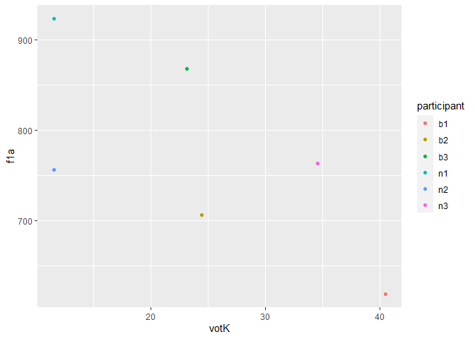<!-- -->

``` r
ggplot(data = all_participants, aes(x = votK, y = f1e, color = participant)) +  
  geom_point()  
```

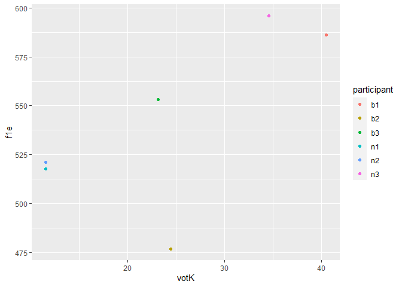<!-- -->

``` r
ggplot(data = all_participants, aes(x = votK, y = f1i, color = participant)) +  
  geom_point()  
```

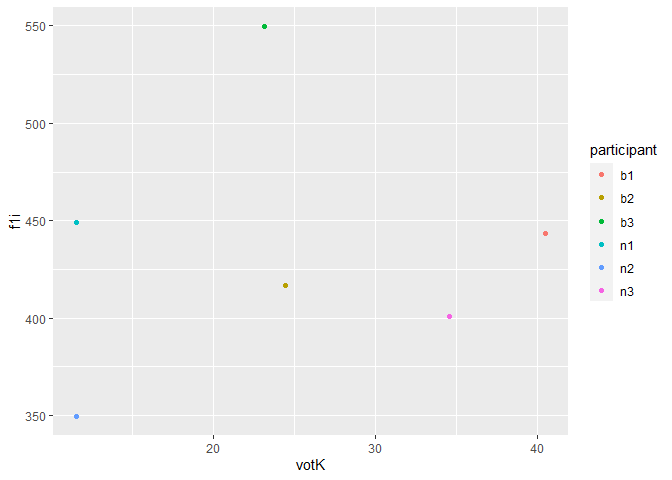<!-- -->

``` r
ggplot(data = all_participants, aes(x = votK, y = f1o, color = participant)) +  
  geom_point()  
```

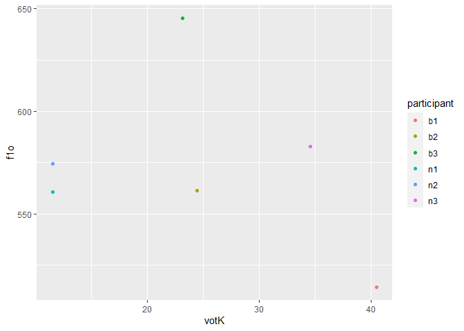<!-- -->

``` r
ggplot(data = all_participants, aes(x = votK, y = f1u, color = participant)) +  
  geom_point()  
```

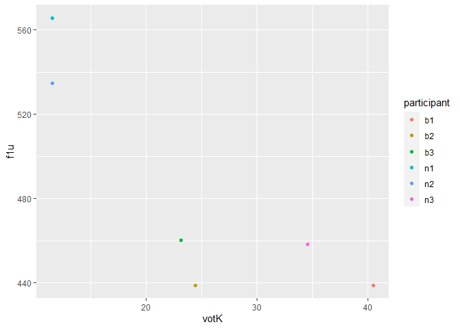<!-- -->

``` r
ggplot(data = all_participants, aes(x = votP, y = f1a, color = participant)) +  
  geom_point()  
```

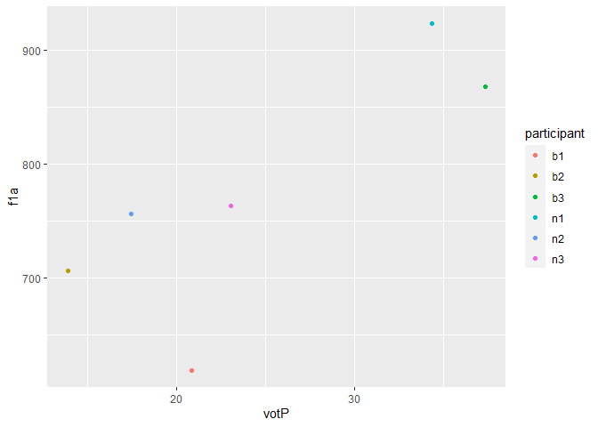<!-- -->

``` r
ggplot(data = all_participants, aes(x = votP, y = f1e, color = participant)) +  
  geom_point()  
```

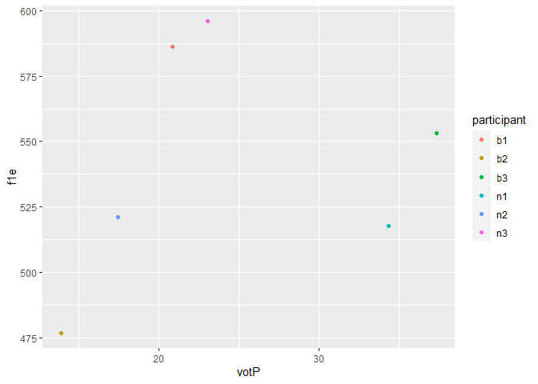<!-- -->

``` r
ggplot(data = all_participants, aes(x = votP, y = f1i, color = participant)) +  
  geom_point()  
```

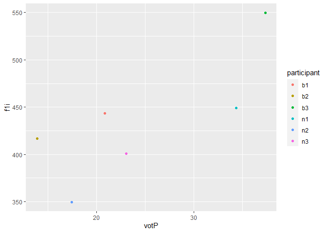<!-- -->

``` r
ggplot(data = all_participants, aes(x = votP, y = f1o, color = participant)) +  
  geom_point()  
```

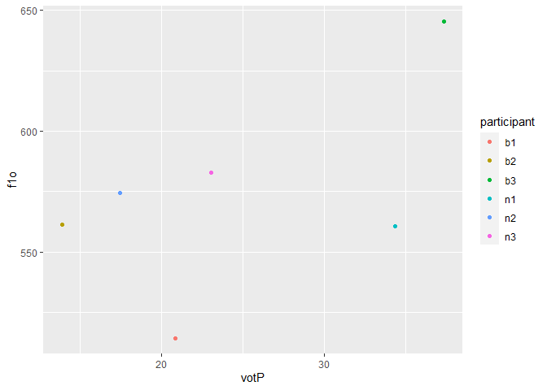<!-- -->

``` r
ggplot(data = all_participants, aes(x = votP, y = f1u, color = participant)) +  
  geom_point()  
```

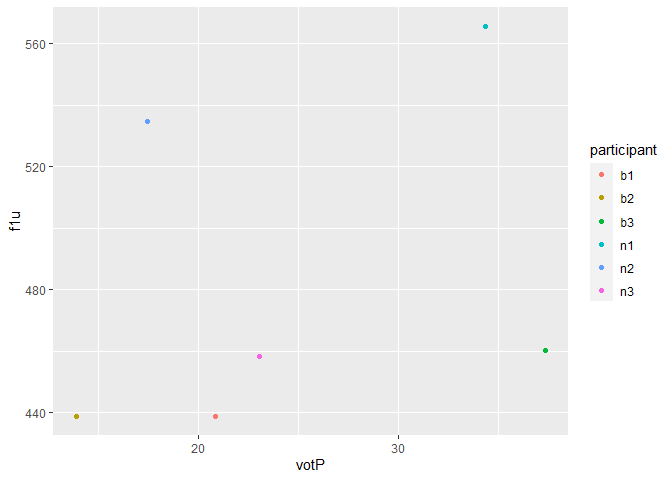<!-- -->

``` r
ggplot(data = all_participants, aes(x = votT, y = f1a, color = participant)) +  
  geom_point()  
```

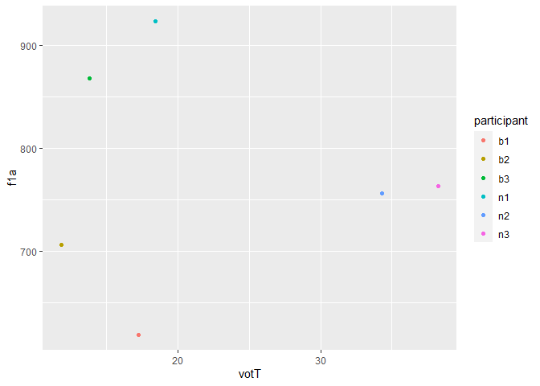<!-- -->

``` r
ggplot(data = all_participants, aes(x = votT, y = f1e, color = participant)) +  
  geom_point()  
```

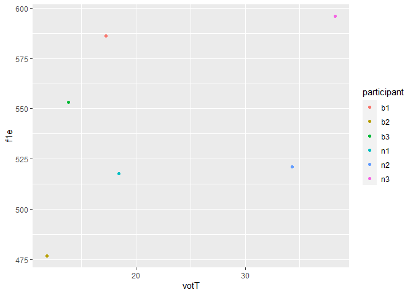<!-- -->

``` r
ggplot(data = all_participants, aes(x = votT, y = f1i, color = participant)) +  
  geom_point()  
```

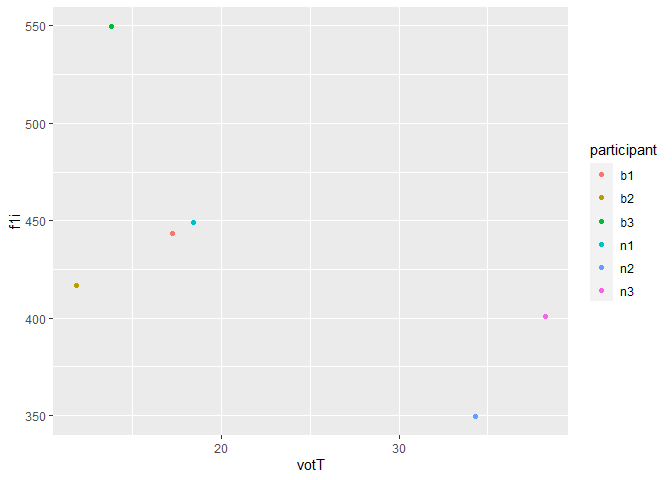<!-- -->

``` r
ggplot(data = all_participants, aes(x = votT, y = f1o, color = participant)) +  
  geom_point()  
```

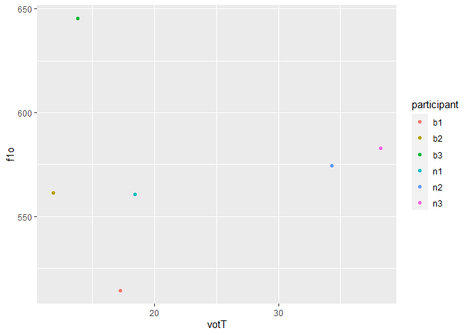<!-- -->

``` r
ggplot(data = all_participants, aes(x = votT, y = f1u, color = participant)) +  
  geom_point()  
```

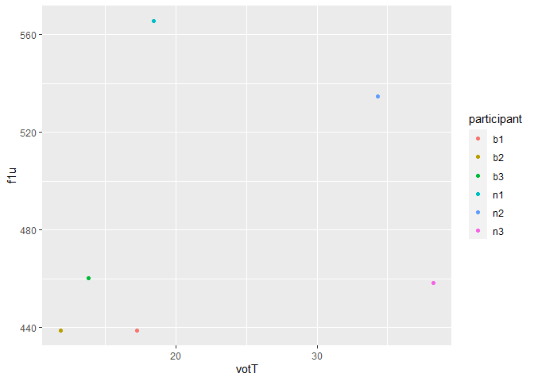<!-- -->

## My original hypothesis of finishing pa_4 before midnight on Monday was incorrect. On the other hand, I am very happy and proud of my progress in using R. I was able to manipulate the data in my .csv files to find means of specific sections, then create a new data frame from those means and plot the resulting data.
